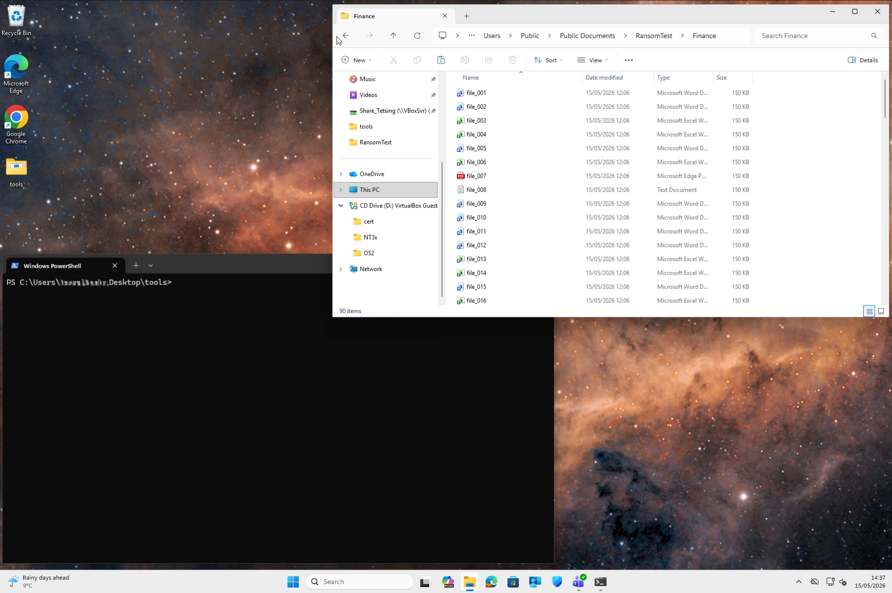
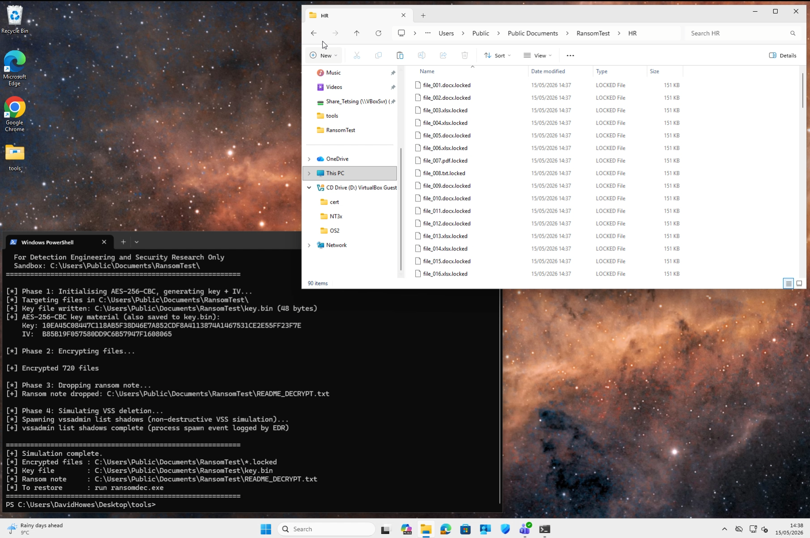
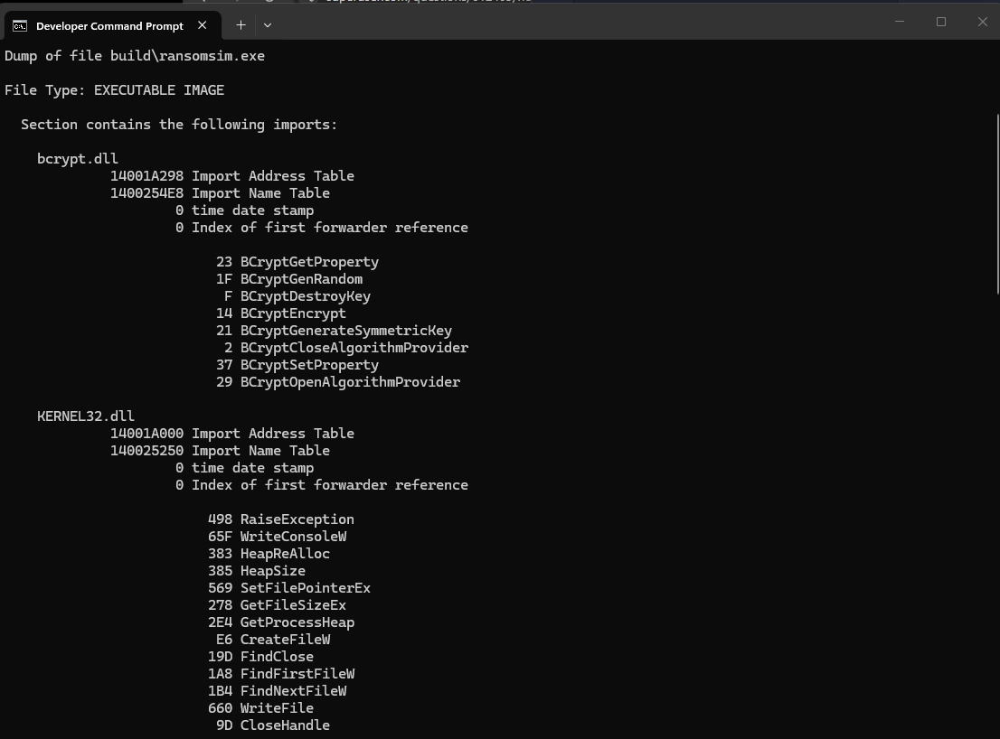
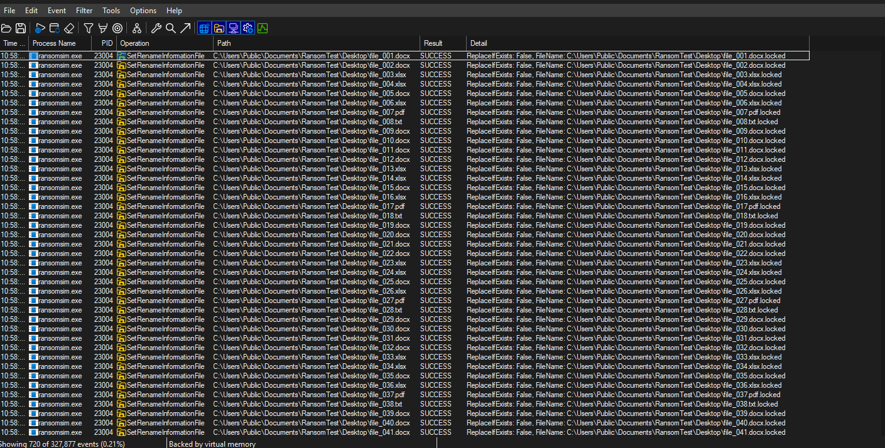
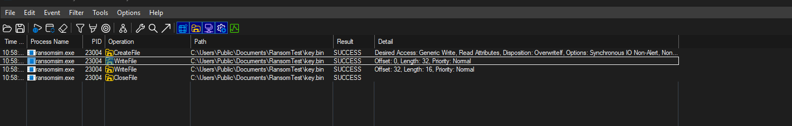
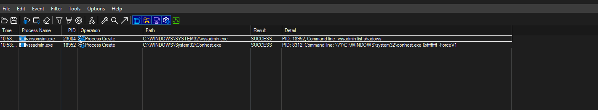
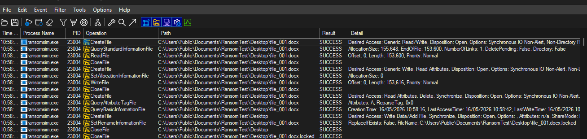

I patched together a ransomware simulation POC with loads of help from our MS Copilot (Copilot wouldn't commit to some of the code but helped with flow).

The simulator behaves like ransomware.     

- Uses Windows Crypto (bcrypt.dll) to perform file encrypt and decrypt
- Uses kernel32.dll APIs for file operations and process creation
- Generates a key.bin file for decryption, once the ransom is paid 
- Encrypts all files within:   C:\Users\Public\Documents\RansomTest\     
- Renames encryptedd files (to .locked) to simulate real ransomware behaviour
- Drops a ransom note after encryption, explaining how to recover files $50k 
- Spawns a vssadmin process and runs a "list shadows" command  (simulates recovery tampering without deleting)    
- Includes a decryptor executable to restore all files.

**Files in \RansomTest: 720 files inside folders and subfolders.**

**Encrypting everything inside RansomTest\***

Did some manual behaviour analysis, here's a sample:

**Imports (library and functions)**

**A load of extension renames from a single process**

**key.bin file creation and the 48bytes being written (the decryption key and IV)**

**Process Creation: vssadmin is created to do bad stuff**

**The full file encryption loop**

